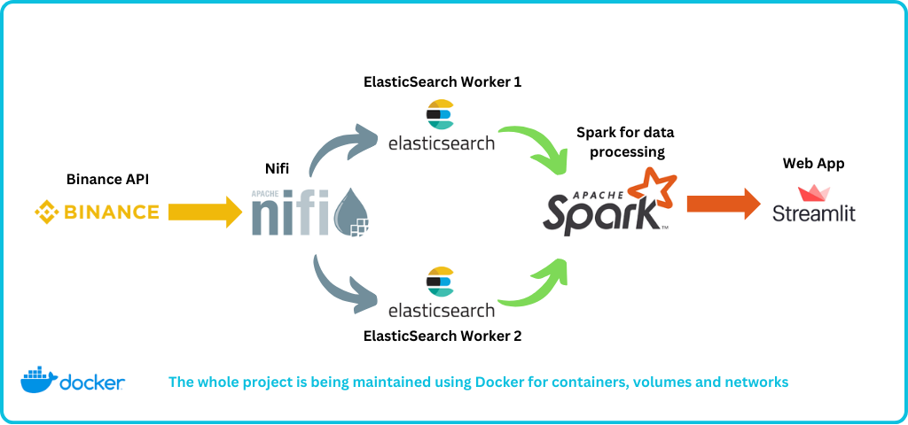
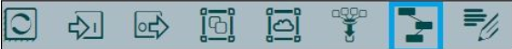

<<<<<<< HEAD
# Investly
Investly is a data/web engineering app that has as goal to make the process of analysing cryptocurrencies data coming from the Binance API easy to manipulate, and give insights to the aspiring investors the opportunity to have realtime insights about their favorite currencies

## Starting the project
To start the project, the first step would be to clone the project from GitHub, so make sure that you have Git and Docker Installed on your system

```
cd your_folder
git clone -b final_version https://github.com/MohamedOuhami/cryptoCurrency_Trading_Plateform.git
```

Now, you should be having the project in your system, to start the project, make sure that you have Docker Engine running

```
cd cryptoCurrency_Trading_Plateform
docker-compose up -d
```

Wait for a few minutes as the services are starting. *If it seems that one of the services are blocking, Press Ctrl+C, and re-run those off services from Docker desktop*

## Project Architecture
The whole project is being ran in Docker with the different servics as seen in the figure down

The project's services are as follow : 
- Binance API : Fetching the data for each cryptocurrency from the Binance API
- Apache Nifi : Data ingestion and make multiple GET requests for the Binance API and putting the data in ElasticSearch
- ElasticSearch worker 1 : The 1st ES worker that stores and feeds data into other services
- ElasticSearch worker 2 : To be tolerant to the high demand that can be, we added a second worker that also fetches the data
- Apache Spark : Used for data analysis and giving insights about the cryptocurrencies
- Streamlit : Used to deploy the webapp and see the data in realtime and do trading simulations

## Launching the services
- After running the services, you can access the NIFI process by visiting the link [NIFI homepage](http:localhost:8091/)
- Add the template named "Real-time_multi-coin_extract" from the button as shown below


- Drag and drop the template process on the canvas and choose the template that we have just imported


- Enter the putElasticSearch process and change the password to 'v01d'
- Press CTRL+a to choose all of the processes and press Start on the left panel

## Start the Web App
- Open a new terminal, and enter in exec mode in the spark-master container
```
docker exec -it spark-master bash
```
- Change the directory to the web-app directory
```
cd web_app
```
- Start the streamlit web app
```
python -m streamlit run investly.py
```

You should now be able to access the application from the link [Investly web app](http://localhost:8502)
# Happy trading

If you have any problem setting up the project, you can email me at mohamed.ouhami2001@gmail.com
=======
# Cryptocurrency Trading Platform

This project provides a comprehensive platform for cryptocurrency trading analysis, leveraging data pipelines, processing frameworks, and a user-friendly dashboard. The solution utilizes Binance API, Docker, Apache NiFi, Apache Spark, Elasticsearch, and Streamlit for real-time data handling, visualization, and strategy testing.

---

## Table of Contents

1. [Features](#features)
2. [Project Architecture](#project-architecture)
3. [Prerequisites](#prerequisites)
4. [Installation](#installation)
5. [Dashboard](#dashboard)

---

## Features

- **Real-Time Data Retrieval:** Fetch cryptocurrency prices in USD from the Binance API.
- **Data Pipeline:** Use Apache NiFi for data collection and integration.
- **Data Processing:** Utilize Apache Spark for ETL operations.
- **Search and Storage:** Store and retrieve data efficiently with Elasticsearch.
- **Trading Strategies:** Implement and backtest strategies like Moving Averages, RSI, and Bollinger Bands.
- **Interactive Dashboard:** Visualize price trends and strategies in real-time with Streamlit.

---

## Project Architecture


### Services

- **Binance API:** Provides cryptocurrency prices.
- **NiFi:** NiFi fetches price data from the Binance API.
- **Elasticsearch:** Stores and indexes the data for efficient retrieval.
- **Apache Spark:** Processes and transforms data for further analysis.
- **Apache Zookeeper:** Manages the coordination and configuration of distributed systems like NiFi and Spark.
- **Streamlit:** Provides an interactive dashboard for analysis and visualization.

### Docker Architecture

- Includes components like NiFi Registry, Zookeeper, Spark Master/Workers, Elasticsearch nodes, and more.
- Uses custom networks and persistent volumes for secure and isolated communication.

---

## Prerequisites

Ensure the following tools are installed:

- [Docker](https://www.docker.com/)
- [Git](https://git-scm.com/)
- Python 3.8+ with required libraries (`pandas`, `streamlit`, etc.)

---

## Installation

1. Clone the repository:
   ```bash
   git clone -b final_version https://github.com/MohamedOuhami/cryptoCurrency_Trading_Plateform.git
   ```
2. Navigate to the project directory:
   ```bash
   cd cryptoCurrency_Trading_Plateform
   ```
3. Open the project in your favorite IDE and review the architecture.

4. Configure environment variables in `.env` file to customize your passwords and settings.
5. Start all services:
   ```bash
   docker-compose up -d
   ```
6. Verify that all containers are running.

   - If you encounter the following error, simply open Docker Desktop and manually start the `es01` and `es02` containers.
     

7. Upload the `Real-time_multi-coin_extract.xml` template from the `nifi_workflows` folder into Apache NiFi to set up the data pipeline:

   

   

   

   - Ensure that you configure the Elasticsearch password specified in the `.env` file.

     

8. Run the Streamlit app to view the dashboard
   - To begin the project, ensure that all containers have started successfully in Docker Desktop.
   - Next, open the command line and execute the following command:
   ```bash
   docker exec -it spark - master bash
   ```
   - Once inside the container, navigate to the project directory by running:
   ```bash
   cd web_app
   ```
   - Finally, start the project using the following command:
   ```bash
   python -m streamlit run investly .py
   ```
9. Navigate to the dashboard in your browser to analyze and visualize cryptocurrency prices and strategies.

---

## Dashboard

The dashboard provides:

- Real-time cryptocurrency price visualization.
- Analysis of selected trading strategies.
- Interactive tools for backtesting trading algorithms.
- Customizable settings for strategy parameters.


>>>>>>> 2a915af (README)
