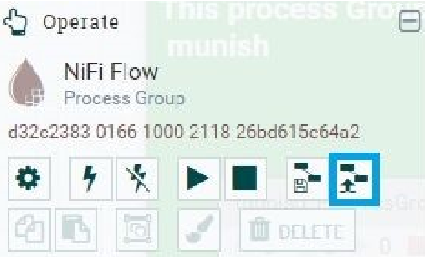

# Investly
Investly is a data/web engineering app that has as goal to make the process of analysing cryptocurrencies data coming from the Binance API easy to manipulate, and give insights to the aspiring investors the opportunity to have realtime insights about their favorite currencies

## Starting the project
To start the project, the first step would be to clone the project from GitHub, so make sure that you have Git and Docker Installed on your system

```
cd your_folder
git clone -b final_version https://github.com/MohamedOuhami/cryptoCurrency_Trading_Plateform.git
```

Now, you should be having the project in your system, to start the project, make sure that you have Docker Engine running

```
cd cryptoCurrency_Trading_Plateform
docker-compose up -d
```

Wait for a few minutes as the services are starting. *If it seems that one of the services are blocking, Press Ctrl+C, and re-run those off services from Docker desktop*

## Project Architecture
The whole project is being ran in Docker with the different servics as seen in the figure down

The project's services are as follow : 
- Binance API : Fetching the data for each cryptocurrency from the Binance API
- Apache Nifi : Data ingestion and make multiple GET requests for the Binance API and putting the data in ElasticSearch
- ElasticSearch worker 1 : The 1st ES worker that stores and feeds data into other services
- ElasticSearch worker 2 : To be tolerant to the high demand that can be, we added a second worker that also fetches the data
- Apache Spark : Used for data analysis and giving insights about the cryptocurrencies
- Streamlit : Used to deploy the webapp and see the data in realtime and do trading simulations

## Launching the services
- After running the services, you can access the NIFI process by visiting the link [NIFI homepage](http:localhost:8091/)
- Add the template named "Real-time_multi-coin_extract" from the button as shown below




- Drag and drop the template process on the canvas and choose the template that we have just imported
- Enter the putElasticSearch process and change the password to 'v01d'
- Press CTRL+a to choose all of the processes and press Start on the left panel

## Start the Web App
- Open a new terminal, and enter in exec mode in the spark-master container
```
docker exec -it spark-master bash
```
- Change the directory to the web-app directory
```
cd web_app
```
- Start the streamlit web app
```
python -m streamlit run investly.py
```

You should now be able to access the application from the link [Investly web app](http://localhost:8502)
# Happy trading

If you have any problem setting up the project, you can email me at mohamed.ouhami2001@gmail.com
